# Architecture

```mermaid
%%{init: {'theme': 'dark', 'themeVariables': { 'primaryColor': '#1a1a2e', 'primaryTextColor': '#e2e8f0', 'primaryBorderColor': '#4a5568', 'lineColor': '#718096', 'secondaryColor': '#2d3748', 'tertiaryColor': '#1a202c'}}}%%

graph TB
    subgraph Input["📥 Input Sources"]
        direction TB
        Slack["Slack Events<br/>(Webhook)"]
        Gmail["Gmail Messages<br/>(Push Notification)"]
        GitHub["GitHub Events<br/>(Webhook)"]
        Jira["Jira Events<br/>(Webhook)"]
        Demo["Demo/Seed<br/>(Manual)"]
    end

    subgraph Ingestion["🔀 Ingestion Layer"]
        direction TB
        Route["Route Webhook"]
        Parse["Parse & Normalize<br/>extractTitle, cleanBody,<br/>buildExternalUrl"]
        Validate["Validate & Enrich"]
        Route --> Parse --> Validate
    end

    subgraph Lemma["🧠 Lemma Engine"]
        direction TB
        subgraph Store["Data Store"]
            Signals["Signals Map"]
            Clusters["Clusters Map"]
            Drafts["Drafts Map"]
            Approvals["Approvals Map"]
            Activities["Activity Log"]
            Releases["Release Summaries"]
        end

        subgraph Agents["AI Agents"]
            Intake["Intake Agent<br/>Classify type, extract<br/>area & platform"]
            Classify["Classification Agent<br/>Label, urgency,<br/>product area"]
            Similarity["Similarity Agent<br/>Find matching clusters<br/>(deterministic)"]
            Triage["Triage Agent<br/>Severity score, root cause,<br/>release risk"]
            Draft["Draft Agent<br/>Generate structured<br/>engineering issue"]
            Review["Review Agent<br/>Quality gate - check<br/>required fields"]
            ReleaseRisk["Release Risk Agent<br/>Aggregate risk<br/>(deterministic)"]
        end

        subgraph Workflows["Durable Workflows"]
            IngestWF["Ingest Workflow<br/>Intake → store signal"]
            TriageWF["Triage Workflow<br/>Classify → Similarity →<br/>Triage → Draft → Review"]
            ApproveWF["Approve Workflow<br/>Approval gate → GitHub<br/>→ Jira → Slack"]
            RejectWF["Reject Workflow<br/>Approval entity →<br/>update state"]
            ReleaseWF["Release Workflow<br/>Release Risk Agent →<br/>store summary"]
        end

        subgraph Persistence["💾 Persistence"]
            MemStore["In-Memory Maps"]
            JSONFile["JSON File<br/>data/store.json<br/>(atomic write)"]
            MemStore <--> JSONFile
        end
    end

    subgraph AI["🤖 AI Layer"]
        Nvidia["NVIDIA API<br/>meta/llama-3.1-8b-instruct<br/>JSON mode"]
        Heuristic["Heuristic Fallback<br/>Regex patterns,<br/>keyword matching"]
        Nvidia -.->|"on failure"| Heuristic
    end

    subgraph Surfaces["🔌 Surface Adapters"]
        GitHubIssue["Create GitHub Issue<br/>POST /repos/{owner}/{repo}/issues"]
        JiraIssue["Create Jira Issue<br/>POST /rest/api/3/issue"]
        SlackMessage["Post Slack Message<br/>chat.postMessage"]
    end

    subgraph UI["🖥️ Next.js UI"]
        Dashboard["Dashboard<br/>Metrics, chart, activity"]
        Inbox["Inbox<br/>Signals list + detail"]
        Clusters["Clusters<br/>Signal groups + triage"]
        Drafts["Drafts<br/>Approve / Reject"]
        Releases["Releases<br/>Risk breakdown + digest"]
        Settings["Settings<br/>Demo injection, status"]
        Auth["Auth<br/>NextAuth v5"]
    end

    %% Input → Ingestion
    Slack --> Route
    Gmail --> Route
    GitHub --> Route
    Jira --> Route
    Demo --> Route

    %% Ingestion → Lemma
    Validate --> Intake
    Intake -->|"store signal"| Signals

    %% Agent → Store flow
    Intake -.->|"updates"| Signals
    Classify -.->|"updates"| Signals
    Similarity -.->|"creates/updates"| Clusters
    Triage -.->|"updates"| Clusters
    Draft -.->|"creates"| Drafts
    Review -.->|"updates"| Drafts
    ReleaseRisk -.->|"creates"| Releases

    %% AI connection
    Intake -->|"callAI()"| Nvidia
    Classify -->|"callAI()"| Nvidia
    Triage -->|"callAI()"| Nvidia
    Draft -->|"callAI()"| Nvidia

    %% Workflow orchestration
    IngestWF --> Intake
    TriageWF --> Classify
    TriageWF --> Similarity
    TriageWF --> Triage
    TriageWF --> Draft
    TriageWF --> Review
    ReleaseWF --> ReleaseRisk

    %% Approval → Surfaces
    ApproveWF --> GitHubIssue
    ApproveWF --> JiraIssue
    ApproveWF --> SlackMessage

    %% UI → Workflows
    Settings -->|"inject signal"| IngestWF
    Clusters -->|"run triage"| TriageWF
    Drafts -->|"approve"| ApproveWF
    Drafts -->|"reject"| RejectWF
    Releases -->|"generate digest"| ReleaseWF

    %% UI → Data
    Dashboard -->|"reads"| Signals
    Dashboard -->|"reads"| Drafts
    Dashboard -->|"reads"| Activities
    Inbox -->|"reads"| Signals
    Clusters -->|"reads"| Clusters
    Drafts -->|"reads"| Drafts
    Releases -->|"reads"| Releases
    Dashboard -->|"reads"| Releases

    %% Store persistence
    Signals --> MemStore
    Clusters --> MemStore
    Drafts --> MemStore
    Approvals --> MemStore
    Activities --> MemStore
    Releases --> MemStore

    %% Legend
    classDef input fill:#1a365d,stroke:#4299e1,color:#bee3f8
    classDef ingestion fill:#22543d,stroke:#48bb78,color:#c6f6d5
    classDef store fill:#3c1a4a,stroke:#b794f4,color:#e9d8fd
    classDef agent fill:#5c2a1a,stroke:#ed8936,color:#feebc8
    classDef workflow fill:#2a4a5c,stroke:#63b3ed,color:#bee3f8
    classDef ai fill:#4a3a1a,stroke:#ecc94b,color:#fefcbf
    classDef surface fill:#3a2a4a,stroke:#d53f8c,color:#fbb6ce
    classDef ui fill:#2d3748,stroke:#a0aec0,color:#e2e8f0
    classDef persist fill:#1a202c,stroke:#718096,color:#cbd5e0

    class Slack,Gmail,GitHub,Jira,Demo input
    class Route,Parse,Validate ingestion
    class Signals,Clusters,Drafts,Approvals,Activities,Releases store
    class Intake,Classify,Similarity,Triage,Draft,Review,ReleaseRisk agent
    class IngestWF,TriageWF,ApproveWF,RejectWF,ReleaseWF workflow
    class Nvidia,Heuristic ai
    class GitHubIssue,JiraIssue,SlackMessage surface
    class Dashboard,Inbox,Clusters,Drafts,Releases,Settings,Auth ui
    class MemStore,JSONFile persist
```



## Data Flow

### Signal Path (Ingest → Triage → Approve)

```
Raw Event (Slack/GitHub/Jira/Gmail/Demo)
    │
    ▼
Webhook Route (/api/webhooks/{source})
    │
    ▼
Ingestion Router (routeIngestion)
    │
    ▼
Parser & Normalizer (source-specific → unified Signal)
    │
    ▼
Intake Agent (classify type: bug/noise/question/feature)
    │
    ▼
Classification Agent (urgency, product area, key phrases)
    │
    ▼
Similarity Agent (match existing cluster or create new)
    │
    ▼
Triage Agent (severity score, root cause, release risk)
    │
    ▼
Draft Agent (structured issue: title, summary, repro steps, labels)
    │
    ▼
Review Agent (quality gate: verify all required fields)
    │
    ▼
Human Approval (Approve/Reject in UI)
    │
    ├── Approve → Create GitHub Issue → Create Jira Issue → Post Slack
    └── Reject  → Log reason → Draft returns to needs-review
```

### AI Decision Flow

```
callAI(systemPrompt, prompt, "json")
    │
    ├── NVIDIA API available? ──Yes──► Parse JSON response → Return structured result
    │
    └── No (key missing, network error, rate limit, invalid JSON)
            │
            ▼
        Heuristic Fallback (regex patterns, keyword matching)
            │
            ▼
        Return deterministic result with lower confidence
```

## Key Design Decisions

| Decision | Rationale |
|----------|-----------|
| **AI-first with heuristic fallback** | Real reasoning when NVIDIA API is available; offline reliability when it's not |
| **File-based JSON persistence** | Zero-dependency, works everywhere Node.js runs, no database setup |
| **Unified Signal model** | All 4 sources normalize into the same structure before entering workflows |
| **Approval gate in Lemma state** | Approval is a first-class entity, not just a UI flag — enables audit trail |
| **Atomic writes with tmp + rename** | Prevents data corruption on crash during write |
| **Structured JSON agent output** | Agent outputs are typed objects, not unstructured chat text |
| **Deterministic similarity + review** | These agents don't need AI — rules are more reliable and faster |
